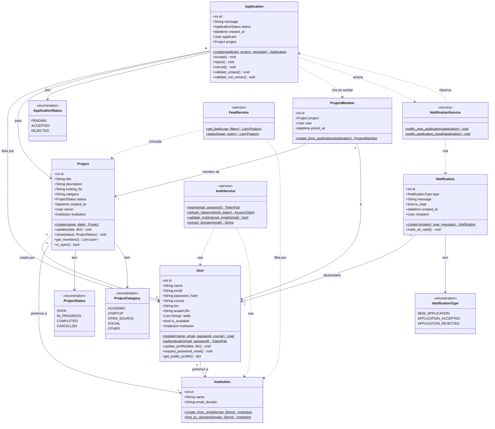

# Linkhub — Diagrama de Classes (UML)

Documento feito a partir do [Documento de Visão](doc-visao.md) e do [Documento de Arquitetura](doc-arquitetura.md).

---

## Diagrama

---

## Descrição das Classes

### Entidades de Domínio

| Classe | Responsabilidade |
|--------|-----------------|
| `Institution` | Representa uma instituição de ensino. Criada automaticamente ao detectar um novo domínio de e-mail. |
| `User` | Estudante cadastrado na plataforma. Possui perfil, habilidades e disponibilidade. |
| `Project` | Iniciativa criada por um estudante. Visível apenas para usuários da mesma instituição. |
| `Application` | Candidatura de um estudante a um projeto. Contém validações de unicidade e propriedade. |
| `ProjectMember` | Criada automaticamente ao aceitar uma candidatura. Representa o vínculo entre estudante e projeto. |
| `Notification` | Aviso gerado de forma síncrona em resposta a eventos de candidatura. |

### Enumerações

| Enumeração | Valores |
|------------|---------|
| `ProjectStatus` | OPEN, IN_PROGRESS, COMPLETED, CANCELLED |
| `ProjectCategory` | ACADEMIC, STARTUP, OPEN_SOURCE, SOCIAL, OTHER |
| `ApplicationStatus` | PENDING, ACCEPTED, REJECTED |
| `NotificationType` | NEW_APPLICATION, APPLICATION_ACCEPTED, APPLICATION_REJECTED |

### Serviços

| Serviço | Responsabilidade |
|---------|-----------------|
| `AuthService` | Autenticação JWT, validação de domínio institucional e geração de tokens. |
| `NotificationService` | Geração síncrona de notificações em resposta a eventos de candidatura. |
| `FeedService` | Montagem do feed cronológico com filtros por instituição, categoria e status. |

---

## Rastreabilidade com os Requisitos

| Classe / Elemento | Requisitos Cobertos |
|-------------------|---------------------|
| `User` + `AuthService` | RF01.01, RF01.02, RF01.03, RF01.04, RF01.05, RF01.06 |
| `Project` + `FeedService` | RF02.01, RF02.02, RF02.03, RF02.04, RF02.05, RF02.06 |
| `Application` + `ProjectMember` | RF03.01, RF03.02, RF03.03, RF03.04, RF03.05 |
| `Notification` + `NotificationService` | RF04.01, RF04.02, RF04.03, RF04.04 |