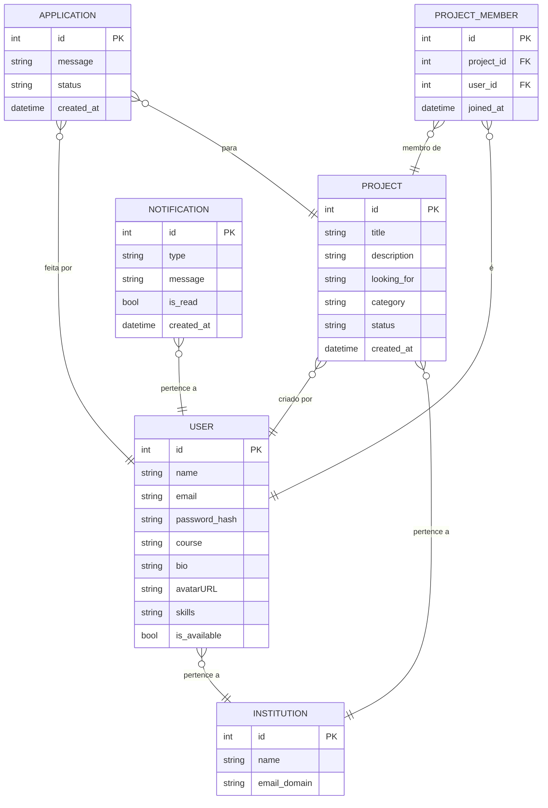

# Documento de Visão — Linkhub

## Descrição do Projeto

O **Linkhub** é uma rede social de projetos voltada para estudantes universitários. O objetivo central da plataforma é permitir que estudantes da mesma instituição de ensino publiquem seus projetos — acadêmicos, startups, open source ou sociais — e encontrem colaboradores dentro do próprio ambiente universitário.

Diferentemente de plataformas como o GitHub, o Linkhub prioriza a **descoberta local e a colaboração entre pessoas próximas**, conectando quem tem um projeto a quem busca experiência prática. O acesso é restrito por e-mail institucional, garantindo que cada estudante interaja apenas com projetos e pessoas da sua instituição.

O sistema permite que usuários criem perfis com habilidades e disponibilidade, publiquem projetos descrevendo o que buscam, se candidatem a projetos de interesse e gerenciem candidaturas recebidas — tudo dentro de um feed cronológico filtrado por categoria e status.

---

## Equipe e Definição de Papéis

| Membro | Papel |
| ------ | ----- |
| Guilherme | Gerente, Desenvolvedor |
| Kaio | Analista, Testador |

### Matriz de Competências

| Membro | Competências |
| ------ | ------------ |
| Guilherme, Kaio | Python, Django, Django REST Framework, PostgreSQL, Git |
| Guilherme, Kaio | React, JavaScript, Tailwind CSS, Testes, Documentação |

---

## Perfis dos Usuários

O sistema será utilizado por um único perfil de usuário na versão MVP:

| Perfil | Descrição |
| ------ | --------- |
| Estudante | Usuário autenticado via e-mail institucional. Pode criar projetos, editar seu perfil, candidatar-se a projetos de outros estudantes da mesma instituição, gerenciar candidaturas recebidas e visualizar notificações. O criador de um projeto tem permissões adicionais de edição, encerramento e gestão de candidatos. |

---

## Lista de Requisitos Funcionais

### Entidade Usuário — US01 — Manter Usuário

Um usuário representa um estudante cadastrado na plataforma. Possui os atributos: id, name, email, password, course, bio, avatarURL, skills e is_available. O e-mail deve pertencer ao domínio institucional da instituição de ensino e é usado como login. O vínculo com a instituição é feito automaticamente pelo domínio do e-mail no momento do cadastro. O avatarURL é um link para a foto de perfil do estudante.

| Requisito | Descrição | Ator |
| --------- | --------- | ---- |
| RF01.01 — Cadastrar Usuário | Insere novo usuário informando: name, email institucional, password, course. O sistema valida o domínio e vincula o usuário à instituição automaticamente. | Estudante (novo) |
| RF01.02 — Login | Autentica o usuário com e-mail e senha, retornando tokens JWT de acesso e refresh. | Estudante |
| RF01.03 — Recuperar Senha | Envia e-mail de recuperação de senha para o endereço cadastrado. | Estudante |
| RF01.04 — Visualizar Perfil Próprio | Exibe todos os dados do usuário autenticado. | Estudante |
| RF01.05 — Atualizar Perfil | Atualiza os atributos: name, bio, avatarURL, course, skills e is_available. | Estudante |
| RF01.06 — Visualizar Perfil Público | Exibe os dados públicos de outro usuário da mesma instituição. | Estudante |

---

### Entidade Projeto — US02 — Manter Projeto

Um projeto representa uma iniciativa criada por um estudante que busca colaboradores. Possui os atributos: id, title, description, looking_for, category, status e created_at. O campo `looking_for` descreve em texto livre o perfil buscado. As categorias possíveis são: Acadêmico, Startup, Open Source, Social e Outros. Os status possíveis são: Aberto, Em andamento, Concluído e Cancelado.

| Requisito | Descrição | Ator |
| --------- | --------- | ---- |
| RF02.01 — Inserir Projeto | Insere novo projeto informando: title, description, looking_for e category. O status inicial é "Aberto". | Estudante |
| RF02.02 — Listar Projetos (Feed) | Lista os projetos da mesma instituição do usuário em ordem cronológica decrescente, com filtros por category e status. | Estudante |
| RF02.03 — Buscar Projetos | Busca projetos pelo título ou categoria. | Estudante |
| RF02.04 — Visualizar Projeto | Exibe os detalhes de um projeto: dados, membros atuais e perfil buscado. | Estudante |
| RF02.05 — Atualizar Projeto | Atualiza um projeto informando: title, description, looking_for, category e status. Restrito ao criador. | Estudante (criador) |
| RF02.06 — Encerrar Projeto | Altera o status do projeto para "Concluído" ou "Cancelado", impedindo novas candidaturas. Restrito ao criador. | Estudante (criador) |

---

### Entidade Candidatura — US03 — Manter Candidatura

Uma candidatura representa o interesse formal de um estudante em participar de um projeto. Possui os atributos: id, message, status e created_at. Os status possíveis são: pending, accepted e rejected. Quando uma candidatura é aceita, o candidato é automaticamente adicionado como membro do projeto via a entidade ProjectMember.

| Requisito | Descrição | Ator |
| --------- | --------- | ---- |
| RF03.01 — Inserir Candidatura | Insere nova candidatura informando uma mensagem de apresentação. O usuário não pode candidatar-se ao próprio projeto nem enviar mais de uma candidatura ao mesmo projeto. | Estudante |
| RF03.02 — Listar Candidaturas do Projeto | Lista todas as candidaturas recebidas por um projeto. Restrito ao criador do projeto. | Estudante (criador) |
| RF03.03 — Aceitar Candidatura | Atualiza o status da candidatura para "accepted" e cria um registro em ProjectMember, adicionando o candidato como membro do projeto. | Estudante (criador) |
| RF03.04 — Recusar Candidatura | Atualiza o status da candidatura para "rejected". | Estudante (criador) |
| RF03.05 — Cancelar Candidatura | O candidato cancela sua própria candidatura enquanto o status for "pending". | Estudante (candidato) |

---

### Entidade Notificação — US04 — Manter Notificação

Uma notificação representa um aviso gerado automaticamente pelo sistema em resposta a um evento relevante. Possui os atributos: id, type, message, is_read e created_at. Os tipos possíveis são: `new_application`, `application_accepted` e `application_rejected`. As notificações são geradas de forma síncrona, na mesma transação do evento que as originou.

| Requisito | Descrição | Ator |
| --------- | --------- | ---- |
| RF04.01 — Gerar Notificação de Candidatura Recebida | Gera automaticamente uma notificação para o criador do projeto ao receber uma nova candidatura. | Sistema |
| RF04.02 — Gerar Notificação de Resultado | Gera automaticamente uma notificação para o candidato ao ter sua candidatura aceita ou recusada. | Sistema |
| RF04.03 — Listar Notificações | Lista as notificações do usuário autenticado em ordem cronológica decrescente. | Estudante |
| RF04.04 — Marcar como Lida | Atualiza o atributo `is_read` de uma notificação para `true`. | Estudante |

---

### Modelo Conceitual

#### Descrição das Entidades

| Entidade | Descrição |
| -------- | --------- |
| INSTITUTION | Representa uma instituição de ensino. Criada automaticamente ao detectar um novo domínio de e-mail no cadastro. |
| USER | Representa um estudante cadastrado na plataforma. Vinculado a uma instituição pelo domínio do e-mail. O atributo avatarURL armazena o link para a foto de perfil. |
| PROJECT | Representa um projeto criado por um estudante. Visível apenas para usuários da mesma instituição. |
| APPLICATION | Representa a candidatura de um estudante a um projeto, com mensagem de apresentação e status de acompanhamento. |
| PROJECT_MEMBER | Tabela de associação criada automaticamente quando uma candidatura é aceita (RF03.03), registrando o vínculo entre o estudante e o projeto com a data de entrada. |
| NOTIFICATION | Representa um aviso gerado automaticamente pelo sistema em resposta a eventos de candidatura. |

---

## Lista de Requisitos Não Funcionais

| Requisito | Descrição |
| --------- | --------- |
| RNF01 — Interface responsiva | O sistema deve funcionar corretamente em dispositivos móveis e desktop, nos navegadores Chrome e Firefox. |
| RNF02 — Desempenho | As páginas principais devem carregar em menos de 3 segundos. Buscas e filtros devem retornar resultados em menos de 2 segundos. |
| RNF03 — Segurança de acesso | O cadastro deve ser restrito a e-mails institucionais. Senhas devem ser armazenadas com hash (PBKDF2). Toda comunicação deve ocorrer via HTTPS em produção. |
| RNF04 — Isolamento de dados | Projetos e usuários são visíveis apenas para membros da mesma instituição. Todas as queries devem ser filtradas por `institution_id`. |
| RNF05 — Autenticação stateless | A autenticação deve usar tokens JWT com access token de curta duração (30 min) e refresh token de 7 dias. |
| RNF06 — Manutenibilidade | Cobertura mínima de testes unitários de 60%. A API deve ser documentada via Swagger (drf-spectacular). |
| RNF07 — Disponibilidade | O sistema deve ter disponibilidade mínima de 95% durante o período letivo. |

---

## Riscos

| Data | Risco | Prioridade | Responsável | Status | Providência/Solução |
| ---- | ----- | ---------- | ----------- | ------ | ------------------- |
| 2025 | Dificuldade com Django REST Framework e JWT por parte da equipe | Alta | Todos | Vigente | Reservar tempo no início do projeto para estudo e implementação de um protótipo base |
| 2025 | Escopo maior do que a equipe consegue entregar no semestre | Alta | Guilherme | Vigente | Manter o escopo restrito ao MVP definido no documento de requisitos v2.0; itens fora do escopo documentados para versões futuras |
| 2025 | Baixa adesão de usuários na fase de testes (problema de cold start) | Média | Guilherme | Vigente | Recrutar colegas da instituição para teste; focar em uma turma ou curso específico como grupo inicial |
| 2025 | Ausência de membro da equipe em período crítico do projeto | Média | Guilherme | Vigente | Documentar bem o código e manter o backlog atualizado para facilitar a redistribuição de tarefas |
| 2025 | Dificuldades com deployment e configuração do ambiente de produção | Baixa | Kaio | Vigente | Usar Railway + Vercel desde o início para familiarização antecipada com o ambiente de produção |